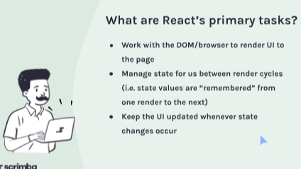

## Meme Generator

- [differences between static and dynamic web sites](#difference-between-static-web-site-and-dynamic-web-app)
- [props vs. state ](#props-vs-state)

  - [array destructuring](#array-destructuring)
  - [complex State array](#complex-state--array)
  - [spread array](#spread-array)
  - [complex state object](#comples-state--object)
  - [ setting state from child component](#setting-state-from-child-component)
  - [passing data to components](#passing-data-to-component)
  - [local state](#local-state)
  - [closure](#closure)
  - [conditional rendering](#conditional-rendering)

- [dynamic styles](#dynamic-styles)
- [React forms](#react-forms)
  - [Controlled Components](#controlled-components)
  - [Submitting the form](#submitting-the-form)
  - [useId](https://react.dev/reference/react/useId#generating-ids-for-several-related-elements)

### difference between static web site and Dynamic web app

static web site : Read only , no changes to data (blogs , news , recipes ,etc )

dynamic web apps : read-write : ability to change data ,highly interActive,display your data,(airbnb ,bankwebsite, onlinegame , facebook) ,any website display data that specific to you

### Props vs. State

**props :** refers to the properties(data) beign passed to a component in order for it to work correctly, this is similar to how a function can receives paramters: "from above" ,just like a function receives paramters A COMPONENT THAT RECEIVES PROPS IS EVER NEVER NOT ALLOWED TO MODIFY THESE PROPS WITHIN BODY OF OUR COMPONENT
(They Are Immutable )
<br/>

<!-- we can change the value we are passed to our component -->

<!-- State : refers to the values that are defined within a component and essentially should be changed , -->

**State :** refers to any values managed by the component itself , kinda like a function that declares its own variables from within that function  
Any time your component has changing values that should be SAVED/DISPLAYED you'll like be using state

<!--
in react vairable that created by component (function it self) are usually handled with state  -->

> React doesn't watch for local variable changes

> Remember what we get back by calling useState? is actually an Array

when we working with state you cannt simply change the value of the [0]. index(state value) instead we are given a function that allows us to make these changes so react can handle those changes recordingly

> we should ever never directly modify our state

#### Array deStructuring

```jsx
const [count, setCount] = React.useState(0);

function add() {
  setCount((count = count + 1));
  // or
  setCount(count++); //or ++count
}
// Common misconception (fallacy)  some thing like count++ is strictly forbidden for react  and that's because we  never want to modify state directly   count++ is shorthand for
// count = count + 1 ;and in this case  using count = is just a  **BIG NO NO**  YOU WILL NEVER EVER DO THAT WHEN YOU'RE MODIFYING STATE
// ther entire reason that we have this setCount function  is so that we can simply  provided a new updated  value  but we will never ever want to  run an equal sign = after our state value
```

best practice to use state value is changing state value with a callBack function

if you ever need to use the old value of state in order to determine the new value of state **you should always plan to pass a callback function to your state setterFunction instead of using state directly**. This callback function will receive the old value of state as its paramter, which you can then use to determine you new value of state

<!-- learn how react handle state changes  and re render  to understand why this is the best practice  -->

```jsx
const [count, setCount] = React.useState(0);
// SetCount(newValue || callBackFunction)

// although currently it's technically working for us to use our  current state value in order to determine  the new state value when we're setting our count.
//  it turns  out there's actually a better way to use  setCount in this case  When Ever We Need To Use Our OldVersion of state to determine our new version of state  and that is by provide a callback function  inside when we provide a call back function  as the parameter to our setterFunction this function needs to return  the new value that we want state to be ,
function add() {
  setCount(count + 1);
}

// if we essentially wanted to  recreated what we did by passing a simple value to our  setCount function we could just have our callback function

setCount(function () {
  return count + 1;
});
// however there is when best practice comes in

// Any time  we need to use our old  state value to determine a new state value  if we provide this function "  React " will pass to this funtion the old value  as parameter here

setCount((hereOldValue) => hereOldValue + 1);

//  what we can do is then take this  oldVale  and use that as our reference  to what count was at the time  this function was called
```

> when we do any change on state inside a component the componenet it self reRendering again (when ever state changes React will reRender the component where state exist, and any child component that rely on the same state to be working correctly )

#### complex state : Array

```jsx
function addItem() {
  // We'll work on this next
  setThingsArray((prevThingsArray) => prevThingsArray.push());
}
// this is not corrct  prevThingsArray is reference to exist state  and using .push() on it  is not a good idea because that modifying the state directly  not only that but .push() actually doesn't return the array that is modifyied  it returns the new length of the array
```

##### Spread array

remember we need to return a new verion of state and my state start out as an array, so i need to make sure when i setting a new array that i 'll return a new array [...spreadExistingOne,newItem]

<!-- when we wanna make an edit on array we create a new array and do edit on it then assign the new one to set function  -->

> `key` is not a prop. Trying to access it will result in `undefined` being returned

#### comples State : object

```jsx
const [contact, setContact] = React.useState({
  firstName: "John",
  lastName: "Doe",
  phone: "+1 (719) 555-1212",
  email: "itsmyrealname@example.com",
  isFavorite: true,
});

let starIcon = contact.isFavorite ? "star-filled.png" : "star-empty.png";

function toggleFavorite() {
  setContact((prevContact) => {
    return {
      // firstName: "John",
      // lastName: "Doe",
      // phone: "+1 (719) 555-1212",
      // email: "itsmyrealname@example.com",
      // isFavorite: true,
      // instead of all code above
      ...prevContact, // make shallow copy of object
      isFavorite: !prevContact.isFavorite, // overwrite isFavorite
    };

    // you can use implicit return like prev => ({the object})
  });
}
```

#### setting state from child component

remember when we have a custom component that we 've created all the properties that we passed are custom properties so adding onclick or onSomeEvent doesn't magically registered as an event listener the event listeners need to exist on native DOM elements .because these are what actually gonna created into Real DOM by react .

so passing a function from parent into child component allow child component to run it and change some things(states) when an event happen

#### passing data to component

there is no way to pass data from one sibling component to another comnponent and there is no way to pass data upward in react
the child component has no idea about sibling or ants uncles components existing

so the only solution we have raise state up a level, and we pass more props downward


over time this can be very tedious especially if your state ends up raising up multiple levels above the component that need it in which case react does offer solution to this called  
context and there is 3rd party state management system like Redux that help to solve this problem

understand that is the ways data flows in react can be very crucial in helping you architect your application in the way that you can share state amongst only the components that need it

AND IN FACT THAT'S AN IMPORTANT DISTINCTION TO MAKE AT THIS POINT IT wouldn't be a great idea to initialize state way up near the top of your component if you don't have components along the entire tree need it ,

> as a rule of thumb keep state as local as you can or in other words keep it as closely tied to the component or components that need it as you possibly can

#### Dynamic styles

```jsx
export default function App() {
    const [squares, setSquares] = React.useState(boxes)

    const styles = {
        backgroundColor:
        // css properties use camelCase version for js
        // hexadecimal color need to be string in js  "#222222"
    }

    const squareElements = squares.map(square => (
        <div style={square && styles} className="box" key={square.id}></div>
    ))
    return (
        <main>
            {squareElements}
        </main>
    )
}


```

#### Local state

[Derived State](https://legacy.reactjs.org/blog/2018/06/07/you-probably-dont-need-derived-state.html)
giving each component the ability of change props that coming from the parent by initialize state based on coming props inside the component. this way not gonna change things in the actually object and any change you gonna do it 'll have no effect when you click refresh (example mark some thing as favorite in E-commerce website)


in onClick event we really not get to decide what parameter get passed to our function every browser will pass an event handler function ,the Event it self (event object that describe a bunch of informations about the event)

```jsx

export default function App() {
    const [squares, setSquares] = React.useState(boxes)

    function toggle(id) {
        console.log(id)
    }

    const squareElements = squares.map(square => (
        <Box
            key={square.id}
            on={square.on}
            toggle={toggle}
        />
    ))


// above code will give us :  SyntheticBaseEvent

// How ever we can work around this by  instead by running props.toggle in box component we can run our own function which then run props.toggle
 onClick={()=>props.toggle(id)}
```

onClick={()=>props.toggle(id)} when we wanna pass a parameter to function that passed as props we use this syntax

<!-- ! note: map function returns a new array without modifiying the original array  that will have the same length as original array and what ever we return from the callback function of .map its what gonna placed in the same index in the new array as what it is in the original one

! in React when you have an element that you either want to display or not display at all using and logical operator is great way to do that

! ternary is really helpful when we want to display one thing based on condition or another thing if that condition is falsy (choose between two thing to display )

-->

#### Closure

instead of passing id as prop down to the box we can pass it in toggle function that we pass it down and this make some thing call closure where each instance of our boxes will have its own toggle function and it will remember its own id

```jsx
function toggle(id) {
  setSquares((prevSquares) => {
    return prevSquares.map((square) => {
      return square.id === id ? { ...square, on: !square.on } : square;
    });
  });
}

const squareElements = squares.map((square) => (
  <Box
    key={square.id}
    // id={square.id} instead of passing it here we passing it inside the func
    on={square.on}
    toggle={() => toggle(square.id)}
  />
));

export default function Box(props) {
  const styles = {
    backgroundColor: props.on ? "#222222" : "transparent",
  };

  return (
    <div
      style={styles}
      className="box"
      // onClick={()=>props.toggle(props.id)} and instead of passing it like this it can as it shown below
      onClick={props.toggle}
    ></div>
  );
}
```

#### conditional rendering

! in React when you have an element that you either want to display or not display at all using and logical operator is great way to do that

! ternary is really helpful when we want to display one thing based on condition or another thing if that condition is falsy (choose between two thing to display )

if there are more than two conditions we use if else statement or switch but we cannot do it inside JSX directly, so instead we do this

```jsx
function App() {
    let someVar
    if () {
        someVar = <SomeJSX />
    } else if() {
        someVar = <SomeJSX1 />
    } else {
        someVar = <SomeJSX2 />
    }
    return (
        <div>{someVar}</div>
    )
}
```

### React forms

<!-- first we need to under stand event object in js  -->

in vanilla js : when we submitted the form it will gather all the data immediately at the very end of the process and then submitted it immediately after gathering it.

how is this different from React?
the main difference in react is that instead of waiting until the very end of the process and filling up the form when the form is submitted and then gathering the data, instead what we do is create a state, and every keystroke change or checkbox change or radio button change we update state and therefore we are watching this inputs every change is made to our form , then when the time to sumbit comes there is no more work need to be done we already gathered the data and we simply submit that to API (maintaining up to date state for every change that happening in any input in our form )

<!-- computed property means that the property name should be take from variable  -->

to make things go easily give each input a name that match property name in our stateObject

```jsx
import React from "react";

export default function Form() {
  const [formData, setFormData] = React.useState({
    firstName: "",
    lastName: "",
  });
  console.log(formData);

  function handleChange(event) {
    setFormData((prev) => ({
      ...prev,
      // [event.target.name]: event.target.value,
      [event.target.name]:
        event.target.type === "checkbox"
          ? event.target.checked
          : event.target.value,
    }));
    // then here to update each property we use computed property from ES6 : which allows us  to use dynamic string that saved inside a variable like a property name
  }

  return (
    <form>
      <input
        type="text"
        placeholder="First Name"
        onChange={handleChange}
        name="firstName"
      />
      <input
        type="text"
        placeholder="Last Name"
        onChange={handleChange}
        name="lastName"
      />
    </form>
  );
}
```

Here’s a cleaned-up and properly formatted version of your markdown:

---

### Controlled Components

[React Documentation: Controlled Components](https://legacy.reactjs.org/docs/forms.html)

In HTML, form elements such as `<input>`, `<textarea>`, and `<select>` typically maintain their own state and update it based on user input.  

In React, mutable state is typically kept in the state property of components and only updated with `setState()`.  

To make the React state the “single source of truth,” we can control form elements through React by assigning a `value` property tied to the state. This ensures the React component renders and controls the form on subsequent user input.  
An input form element controlled in this way is called a **“controlled component.”**

Good practice in React is to let React's state drive the input box value. By adding the `value` property to an input element and tying it to a matching state property, we can achieve this.

```jsx
import React from "react";

export default function Form() {
  const [formData, setFormData] = React.useState({
    firstName: "",
    lastName: "",
    email: "",
    isFriendly: true,
    employment: "",
  });

  // Handle input changes and update the corresponding state property
  function handleChange(event) {
    const { name, value } = event.target;
    setFormData((prevFormData) => ({
      ...prevFormData,
      [name]: value,
    }));
  }

  return (
    <form>
      <input
        type="text"
        placeholder="First Name"
        onChange={handleChange}
        name="firstName"
        value={formData.firstName}
      />
      <input
        type="text"
        placeholder="Last Name"
        onChange={handleChange}
        name="lastName"
        value={formData.lastName}
      />
      <input
        type="email"
        placeholder="Email"
        onChange={handleChange}
        name="email"
        value={formData.email}
      />

      <input
        type="checkbox"
        id="isFriendly"
        checked={formData.isFriendly}
        onChange={handleChange}
        name="isFriendly"
      />
      <label htmlFor="isFriendly">Are you friendly?</label>
      <br />

      <fieldset>
        <legend>Current Employment Status</legend>
        <input
          type="radio"
          id="unemployed"
          name="employment"
          value="unemployed"
          checked={formData.employment === "unemployed"}
          onChange={handleChange}
        />
        <label htmlFor="unemployed">Unemployed</label>
        <br />

        <input
          type="radio"
          id="part-time"
          name="employment"
          value="part-time"
          checked={formData.employment === "part-time"}
          onChange={handleChange}
        />
        <label htmlFor="part-time">Part-time</label>
        <br />

        <input
          type="radio"
          id="full-time"
          name="employment"
          value="full-time"
          checked={formData.employment === "full-time"}
          onChange={handleChange}
        />
        <label htmlFor="full-time">Full-time</label>
      </fieldset>

      <label htmlFor="favColor">What is your favorite color?</label>
      <br />
      <select
        id="favColor"
        name="favColor"
        value={formData.favColor}
        onChange={handleChange}
      >
        <option value="">-- Choose --</option>
        <option value="red">Red</option>
        <option value="orange">Orange</option>
        <option value="yellow">Yellow</option>
        <option value="green">Green</option>
        <option value="blue">Blue</option>
        <option value="indigo">Indigo</option>
        <option value="violet">Violet</option>
      </select>
    </form>
  );
}
```

Visually, the form behaves the same, but conceptually, React now controls the inputs' state. When you type into an input, the `handleChange` function updates the state, triggering a re-render of the form with the updated state values.

The main benefit of controlled components is that React warns you about **uncontrolled components** if inputs are not properly managed.

---

### Submitting the Form

A significant advantage of this setup is that you don’t need to gather input values when submitting the form. The state is already up-to-date with the user’s input.

```jsx
function handleSubmit(event) {
  event.preventDefault();
  submitToApi(formData);
}
```

---

### [useEffect](https://overreacted.io/a-complete-guide-to-useeffect/)



Side effects include interacting with systems outside React's scope, such as local storage or APIs.

#### Making API Calls with `useEffect`

When working with APIs in React, the process typically involves:  
1. Fetching data from the API.  
2. Storing that data in state.

Here’s an example where improper placement of the `fetch` call leads to an **infinite loop**:

```jsx
import React from "react";

export default function App() {
  const [starWarsData, setStarWarsData] = React.useState({});

  fetch("https://swapi.dev/api/people/1")
    .then((res) => res.json())
    .then((data) => setStarWarsData(data));

  return (
    <div>
      <pre>{JSON.stringify(starWarsData, null, 2)}</pre>
    </div>
  );
}
```

### Fixing Infinite Loop with `useEffect`

To fix this, we can use `useEffect` to control when the fetch request runs.  

```jsx
import React from "react";

export default function App() {
  const [starWarsData, setStarWarsData] = React.useState({});

  React.useEffect(() => {
    fetch("https://swapi.dev/api/people/1")
      .then((res) => res.json())
      .then((data) => setStarWarsData(data));
  }, []); // Empty dependency array ensures this effect runs only once.

  return (
    <div>
      <pre>{JSON.stringify(starWarsData, null, 2)}</pre>
    </div>
  );
}
```

---

### `useEffect` Cleanup Function

`useEffect` can also clean up side effects to prevent resource leaks.  

```jsx
import React from "react";

export default function WindowTracker() {
  const [windowWidth, setWindowWidth] = React.useState(window.innerWidth);

  React.useEffect(() => {
    function handleResize() {
      setWindowWidth(window.innerWidth);
    }

    window.addEventListener("resize", handleResize);

    return () => {
      window.removeEventListener("resize", handleResize);
    };
  }, []);

  return <h1>Window width: {windowWidth}</h1>;
}
```

---

### Accessibility Best Practices

- Ensure all elements are keyboard-focusable.  
- Use `aria-label` for buttons without visible text to describe their functionality.  
- Use `aria-pressed` for toggling buttons to indicate state.  
- Always add `alt` text for images.  
- Use `<button>` tags for clickable areas.

Example:

```jsx
export default function Star(props) {
  const starIcon = props.isFilled ? "star-filled.png" : "star-empty.png";
  const buttonLabel = props.isFilled
    ? "Unmark as favorite"
    : "Mark as favorite";

  return (
    <button
      onClick={props.handleClick}
      aria-label={buttonLabel}
      aria-pressed={props.isFilled}
    >
      
    </button>
  );
}
```
